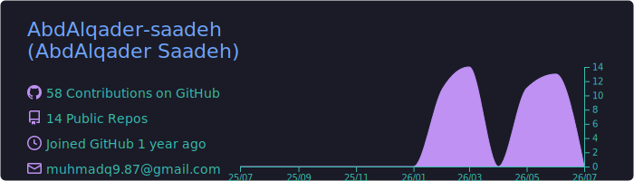
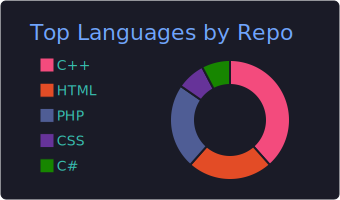
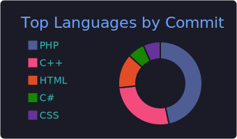
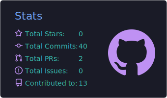

<!-- HEADER -->

<h1 align="center">👋 Hello, I'm AbdAlqader Saadeh</h1>

---

# 👨‍💻 About Me

💻 Passionate **Software Developer** and Computer Information Systems student at the University of Jordan. I specialize in building robust web applications using Laravel and desktop solutions using C#.

📚 **Currently Learning & Improving:**
🔹 Advanced Software Architecture & Design Patterns
🔹 Enterprise Application Development
🔹 Professional Communication & Emotional Intelligence (McKinsey Forward Journey)

📈 **What I Do:**
* Develop full-stack web applications with complex permission and management systems.
* Design optimized database schemas and relational models.
* Apply OOP principles to write clean, maintainable, and scalable code.

---

# 🛠 Skills & Tools

---

# 🚀 Featured Projects

### 🏫 School-App (Educational Management Platform)
A comprehensive Learning Management System built with **Laravel** to manage courses, students, and educational workflows.

### ⏱️ Attendance Management System
A web application built using **Laravel 11** and **Bootstrap 5** featuring multi-level permissions, role management, and shift tracking.

### 🏦 Bank Management System
A desktop application designed and built using **C++** and core **Object-Oriented Programming (OOP)** principles to simulate banking operations.

---

# 📊 GitHub Metrics Dashboard

  <!-- قراءة تفاصيل الحساب واللغات مباشرة من الملفات الديناميكية المولدة في حسابك -->
  
  

  <!-- قراءة لغات الـ Commits والإحصائيات العامة -->
  
  

---

# 📬 Connect With Me

---

<!-- FOOTER -->

